# 🐙 The Tech Tentacles

### *Reach Beyond Limits, Innovate Without Boundaries*

---

### 🌊 *Where Innovation Meets Excellence*

## 👋 Welcome to The Tech Tentacles

Welcome to **The Tech Tentacles** – a dynamic startup where creativity, technology, and innovation converge! Like a tentacle reaching across the digital ocean, we extend our expertise across multiple domains to help businesses thrive in the modern tech landscape.

We're not just another tech company; we're your partners in digital transformation, combining cutting-edge technology with creative solutions to bring your vision to life.

---

## 🚀 What We Do

### Our Core Services

### 🌐 Web Development
Transform your digital presence with stunning, responsive, and high-performance web applications.
- **Frontend Magic**: React, Vue, Angular, Next.js - creating seamless user experiences
- **Backend Powerhouse**: Node.js, Python, Django, FastAPI - building robust server architectures
- **Full-Stack Solutions**: End-to-end development from concept to deployment
- **Modern Tech Stack**: Progressive Web Apps, Serverless, Microservices
- **E-commerce Platforms**: Custom online stores that drive sales

### 🤖 AI/ML Solutions
Harness the power of Artificial Intelligence and Machine Learning to unlock insights and automate processes.
- **Machine Learning Models**: Custom ML solutions tailored to your business needs
- **Deep Learning**: Neural networks, computer vision, NLP applications
- **Predictive Analytics**: Data-driven forecasting and decision making
- **AI Integration**: Seamlessly integrate AI into your existing systems
- **Intelligent Automation**: Automate repetitive tasks with smart algorithms

### 📊 Data Analytics
Turn raw data into actionable insights that drive business growth.
- **Business Intelligence**: Interactive dashboards and reporting solutions
- **Data Visualization**: Beautiful, intuitive charts and graphs using Tableau, Power BI
- **Big Data Processing**: Handle and analyze large-scale datasets
- **Statistical Analysis**: Deep dive into your data with advanced analytics
- **Real-time Analytics**: Monitor your business metrics as they happen

---

## 💡 Why Choose The Tech Tentacles?

| 🎯 Innovative Approach | 🔧 Technical Excellence | 🤝 Client-Centric | ⚡ Agile Delivery |
|:---:|:---:|:---:|:---:|
| We bring fresh perspectives to every project | Cutting-edge tech stack & best practices | Your success is our success | Fast iterations, rapid deployment |

- **🌟 Quality First**: We don't compromise on quality – every line of code, every model, every insight is crafted with precision
- **💪 Expert Team**: Two passionate founders with diverse expertise across the tech spectrum
- **🔄 Continuous Innovation**: We stay ahead of the curve, constantly learning and adapting to new technologies
- **📈 Growth Partners**: We don't just deliver projects; we build long-term relationships
- **🎨 Creative Solutions**: Unique problems deserve unique solutions – we think outside the box

---

## 👥 Meet The Founders

### Two Minds, Infinite Possibilities

We are a team of **two dedicated founders** who share a passion for technology and innovation. With complementary skills spanning web development, AI/ML, and data analytics, we bring a unique blend of technical expertise and entrepreneurial spirit to every project.

**Our Mission**: *To empower businesses with technology that transforms ideas into reality*

**Our Vision**: *To become the go-to tech partner for startups and enterprises seeking innovative, reliable solutions*

---

## 🛠️ Technologies We Master

### Frontend

### Backend

### AI/ML & Data

### Database & Cloud

---

## 🌈 Our Process

```mermaid
graph LR
    A[💡 Ideation] --> B[📋 Planning]
    B --> C[🎨 Design]
    C --> D[⚙️ Development]
    D --> E[🧪 Testing]
    E --> F[🚀 Deployment]
    F --> G[📊 Monitoring]
    G --> H[🔄 Iteration]
```

We follow an **agile, iterative approach** that ensures:
- 🎯 Clear communication at every step
- 📈 Regular progress updates
- 🔍 Quality assurance throughout
- 🚀 Timely delivery without compromising quality

---

## 🎯 Let's Build Something Amazing Together!

### Ready to Transform Your Ideas into Reality?

Whether you're a startup with a groundbreaking idea, an enterprise seeking digital transformation, or anywhere in between – we're here to help you succeed.

### 📬 Get In Touch

**We'd love to hear from you!**

💼 **Business Inquiries**: Open an issue or discussion on this repository  
🌐 **Explore Our Work**: Check out our repositories and projects  
🤝 **Collaborate**: We're always open to exciting collaborations  
⭐ **Stay Updated**: Star this repository to keep track of our journey

---

### 🌟 Join Our Community

---

🙠**The Tech Tentacles** - Reaching Beyond Limits, One Project at a Time

**Made with ❤️ and ☕ by The Tech Tentacles Team**

