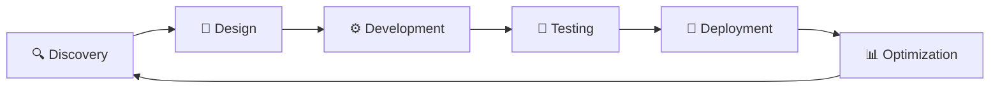

# 🐙 The Tech Tentacle

### *Reaching New Heights in Digital Innovation*

---

## 🌊 About Us

Welcome to **The Tech Tentacle** - where innovation meets execution! We are a dynamic startup founded by two passionate technologists who believe in transforming ideas into digital reality. Like a tentacle that reaches and adapts, we extend our expertise across multiple domains to help businesses thrive in the digital age.

### 🚀 *"Eight arms, infinite possibilities"*

---

## 🎯 Our Services

<table>
<tr>
<td width="33%" align="center">

### 🌐 Web Development
**Full-Stack Excellence**

- Modern React & Next.js Applications
- Responsive UI/UX Design
- E-commerce Solutions
- Progressive Web Apps (PWAs)
- API Development & Integration
- Cloud Deployment & DevOps

</td>
<td width="33%" align="center">

### 🤖 AI/ML Solutions
**Intelligence Amplified**

- Machine Learning Models
- Natural Language Processing
- Computer Vision Applications
- Predictive Analytics
- AI Chatbots & Automation
- Custom AI Integrations

</td>
<td width="33%" align="center">

### 📊 Data Analytics
**Insights Unleashed**

- Business Intelligence Dashboards
- Data Visualization
- Statistical Analysis
- ETL Pipeline Development
- Real-time Analytics
- Data Strategy Consulting

</td>
</tr>
</table>

---

## 🛠️ Tech Stack

### Frontend

### Backend

### AI/ML & Data

### Cloud & DevOps

---

## 👥 Meet the Founders

<table>
<tr>
<td align="center" width="50%">

### 🧑‍💻 Founder 1
**Full-Stack Architect: Rakesh Yadav**

*"Turning coffee into code since 2024"*

</td>
<td align="center" width="50%">

### 🧑‍🔬 Founder 2
**AI/ML Specialist: Prabhu Badkar**

*"Making machines think, one algorithm at a time"*

</td>
</tr>
</table>

---

## 🎨 Why Choose The Tech Tentacle?

| 🚀 **Innovation First** | 🎯 **Client-Centric** | 💡 **Agile Approach** | 🔧 **Quality Assured** |
|:---:|:---:|:---:|:---:|
| We stay ahead of tech trends | Your success is our priority | Rapid prototyping & iteration | Rigorous testing & optimization |

### ✨ Our Unique Value Proposition

- **🔄 End-to-End Solutions**: From concept to deployment, we handle it all
- **🧠 AI-First Mindset**: Integrating intelligence into every solution
- **📈 Scalable Architecture**: Built to grow with your business
- **🤝 Collaborative Partnership**: We work with you, not just for you
- **⚡ Rapid Delivery**: Agile methodologies for faster time-to-market

---

## 📈 Our Process

1. **Discovery** - Understanding your vision and requirements
2. **Design** - Creating user-centric designs and architecture
3. **Development** - Building with cutting-edge technologies
4. **Testing** - Ensuring quality and performance
5. **Deployment** - Launching your solution to the world
6. **Optimization** - Continuous improvement and scaling

---

## 🌟 Featured Projects

### 🔜 Coming Soon!
*We're working on some amazing projects that will showcase our capabilities. Stay tuned!*

---

## 📞 Let's Connect!

### Ready to bring your ideas to life?

**We'd love to hear about your project!**

---

### 🐙 *The Tech Tentacle - Embracing Innovation, Delivering Excellence*

**Made with ❤️ by The Tech Tentacle Team**

---

*© 2024 The Tech Tentacle. All rights reserved.*

